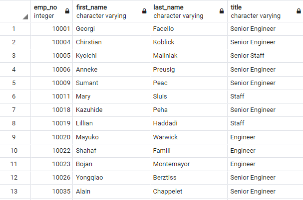

# Pewlett-Hackard-Analysis
Pewlett-Hackard retirement and mentoring analysis using SQL database.

## Project Background and Goals

* SQL stands for Structured Query Language that used to communicate with a database for managing data held in a relational database management system.
* SQL is one of the most widely used query languages used everywhere—small and large businesses, and even individuals working on personal projects.
* We will organize and query data, especially on a large scale, makes SQL knowledge a highly sought after skill in the workforce from the Pewlett Hackard analysis.

* Here is the list of deliverables for the SQL analysis of the Pewlett Hackard analysis:

    - The Entity Relationship Diagrams (ERDs) that hold the primary and foreign keys and data types for each column.
    - Three forms of ERDs: conceptual, logical, and physical diagram.
    - Create a Database in SQL using Postgres and pgAdmin.
    - Write Statements to Create Tables and import and export csv file type of tables, and handle Error Messages.
    - Perform queries to learn when employees were hired as well as their age using join, group by, count, etc.


* This analysis improves the access to determine how many people will be retiring and, of those employees, who is eligible for a retirement package.
* Update list is general employee information with Employee number, First and Last names,  Gender, to_date, and their current salaries.
* We also determine the number of retiring employees per departments and tiltles, and identify employees who are eligible to participate in a mentorship program. 

## The process of project

* Verify that PostgreSQL and pgAdmin are installed correctly.
* Be able to create a SQL database using Query
* Import and export CSVs into database tables
* Combine data using joins and count the total number of rows
* Use the DISTINCT ON statement to retrieve the first occurrence for each set of rows

## Software/Tools/Libraries
* PostGreSQL 4.24. pgAdmin 4, Visual studio 1.50.
* Data Source: departments.csv, dept_emp.csv, dept_manager.csv, employees.csv, salaries.csv, titles.csv

## Results


1. The Entity Relationship Diagrams (ERDs) demonstrates relationships between 6 tables using the Quick Database Diagrams Tools:

text file for ERD : [Entity Relationship Diagrams](ERD.txt)


2. retirement_info and dept_emp tables:

- SQL for all Retirement Eligibility:[retirement_info.csv](data/retirement_info.csv)

*Queries*

```
SELECT emp_no, birth_date, first_name, last_name, genger AS gender, hire_date
INTO retirement_info
FROM employees
WHERE (birth_date BETWEEN '1952-01-01' AND '1955-12-31')
AND (hire_date BETWEEN '1985-01-01' AND '1988-12-31');

```
* Table image. head(12)


# Challenge

## Object

- Create a retirement titles table that holds all the titles of current employees who are retiring (filter by January 1, 1952 and December 31, 1955).
- Remove the duplicates of titles and create a table that contains the most recent title of each employee.
- Count the number of titles from the unique titles.
- Create a list of candidates for the mentorship program (the current employees filterd by January 1, 1965 and December 31, 1965).


### 1. Create a retirement titles table that holds all the titles of current employees 
-- who were born between January 1, 1952 and December 31, 1955

*Queries*

```
SELECT e.emp_no, 
	e.first_name, 
	e.last_name,
	ti.title, 
	ti.from_date, 
	ti.to_date
INTO retirement_titles
FROM employees AS e
INNER JOIN Titles AS ti
ON (e.emp_no = ti.emp_no)
WHERE (e.birth_date BETWEEN '1952-01-01' AND '1955-12-31')
ORDER BY ti.emp_no;

SELECT * FROM retirement_titles;
```
Retirement titles table(csv) that holds all the titles of current employees, first name, last name, from and to dates:

[retirement_titles.csv](data/retirement_titles.csv)

* Table image. head(12)


**-Conclusion** 
 - There are 133776 records of individuals ready to retirement.
 - Some employees have multiple titles in the database and create a table that contains the most recent title of each employee.


### 2. Remove the duplicates and displayonly the most recent title of each employee

-Create a unique ritles table that contains the employee number, first and last name, and most recent title.
-Use the DISTINCT ON fuction to retrieve the first occurrence of the employee number for each set of rows.
-Sort the unique titles table in ascending order by the employee number and descending order by the last date.

*Queries*
```
SELECT DISTINCT ON (emp_no) emp_no,
	first_name, 
	last_name, 
	title
INTO retirement_unique_titles
FROM retirement_titles AS rt
ORDER BY emp_no ASC, to_date DESC ;

SELECT * FROM retirement_unique_titles;
```
- Current retirement eligibility table(csv) with current title:

[retirement_unique_titles.csv](data/retirement_unique_titles.csv)

* Table image. head(13)



**-Conclusion**
 - There are 90,398 records of Current Retirement Eligibility.


### 3. The Frequency count of employee titles 
- Count the number of titles from the Unique Titles table
- Create a retiring titles tables
- Group the table by title, then sort the count column in descending order

*Queries*

```
SELECT COUNT(rt.emp_no), rt.title
INTO retiring_titles_info
FROM retirement_unique_titles AS rt
GROUP BY rt.title
ORDER BY 1 DESC;
SELECT * FROM retiring_titles_info;
```
- Retiring Titles table that contains the number of titles filled by employees who are retiring:

[retiring_titles.csv](data/retiring_titles.csv)

* Table image


**-Conclusion**
 - In the 90,398 records of Current Retirement Eligibility, there are retiring titles with 29,414 Senior Engineer, 28,254 Senior Staffs, 14,222 Engineers, 12,243 Staff, 4502 Technique Leader, 1761 Assistant Engineers, and two managers. 


### 4. Determining the number of individuals available for mentorship role

 - Create a mentorship-eligibility table that holds the current employees who were born between January 1, 1965 and December 31, 1965.

*Queries*

```
SELECT DISTINCT ON (em.emp_no) em.emp_no, 
	em.first_name, 
	em.last_name,
	em.birth_date,
	de.from_date, 
	de.to_date,
	ti.title
INTO mentorship_eligibilty
FROM Employees AS em
INNER JOIN dept_emp AS de 
ON em.emp_no = de.emp_no
INNER JOIN titles AS ti 
ON em.emp_no = ti.emp_no
WHERE (em.birth_date BETWEEN '1965-01-01' AND '1965-12-31')
AND (de.to_date = '9999-01-01')
ORDER BY em.emp_no;
SELECT * FROM mentorship_eligibilty;
```
SQL exported csv file for eligible for mentor program:

[mentorship_eligibilty.csv](data/mentorship_eligibilty.csv)

* Mentorship eligibility table for current employees (table head(13))


**Conclusion, there are 1549 active employees eligible for mentor plan.**

### Limitation and Suggestion
 
 1. This project assumed retirement years between 1952 and 1955. 
 We need to narrow down period into 3 single year for more accurate estimate and better analysis of potential job opening. 

 2. More detail information and analysis are needed for potential mentor table, 
 to compare with the title table of current ready-to-retirement 
 and get a better estimate of outside hiring request. 
